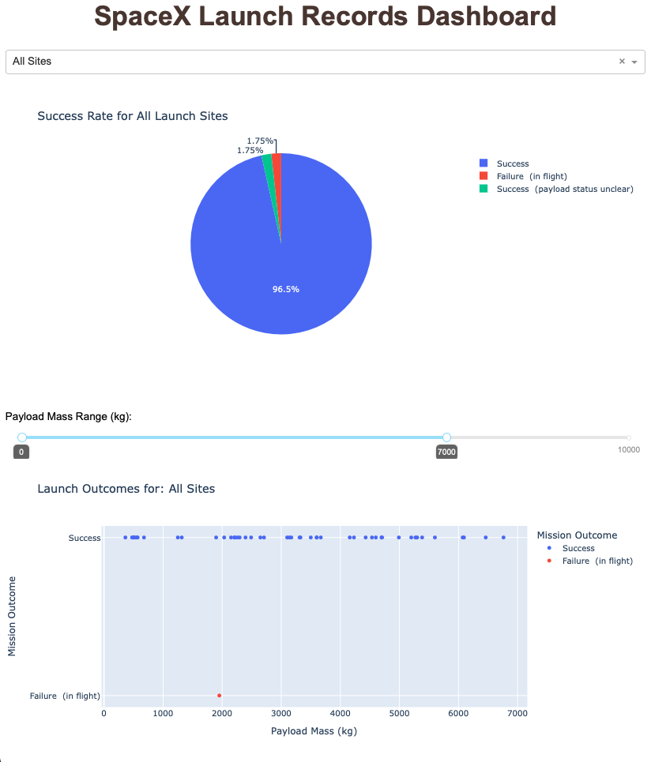

# SpaceX Launch Data Dash Visualizer

A clean and simple dashboard application that visualizes outcomes of SpaceX Falcon 9 Launches. The [dataset](https://www.kaggle.com/datasets/scoleman/spacex-launch-data/data) was downloaded from Kaggle.

## Functionality

One can filter plot outputs by:

-   Selecting a launch site using the dropdown menu
-   Utilizing the slider to select launches within a certain range of payload masses

## Screenshot

### Libraries

-   **dash**: Creation of HTML dash application and plots
-   **pandas**: Loading .csv data into a DataFrame, for plotting by plotly dash
-   **numpy**: Numerical manipulation of data

## Starting the Application

Start the application by running:

`docker compose up --build`

The application will be available at http://localhost:9000.
